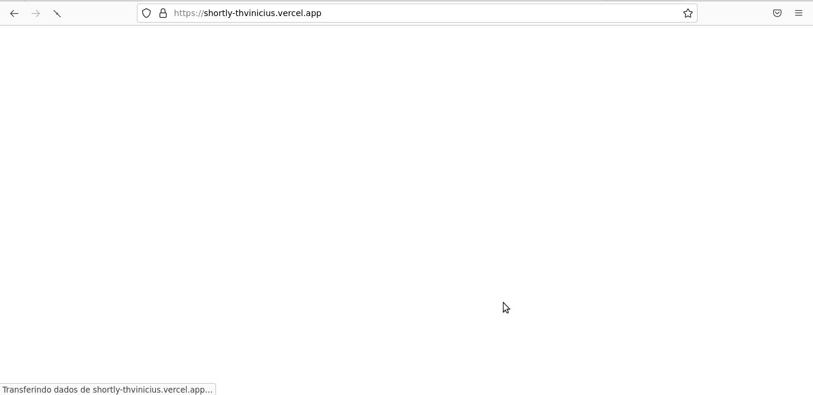

<p align="center">
  
</p>
<h1 align="center">
  Shortly
</h1>
<div align="center">

  <h3>Construido com</h3>

  
  
  <!-- Badges source: https://dev.to/envoy_/150-badges-for-github-pnk -->
</div>

<br/>

# Sumário

- [Descrição](#description)
- [Rotas do Shortly](#routes)
  - [Rota /](#start)
  - [Rota /home](#home)
- [Environment Variables](#environment-variables)
- [Run Locally](#run-locally)

<div id='description'/>

# Descrição

Shortly é um sistema de encurtador de URLs

</br>

## Features

- Criar uma conta e acessa-la.
- Criar um link encurtado
- Acessar um link encurtado
- Visualizar o ranking de usuários com mais links e com mais visitas

</br>

<div id='routes'/>

## Rotas do Shortly

<div id='start'/>

### Rota /

Nessa rota é possivel:

- Visualizar o ranking
- Acessar a página de cadastro
- Acessar a página de acesso

<h1 align="center" >

</h1>

#

<div id='home'/>

### Rota /home

Nessa é possivel:

- Criar um link encurtado
- Acessar um link encurtado
- Deletar um link encurtado
- Filtrar seus links

<h1 align="center" >

</h1>

<div id='environment-variables'/>

## Environment Variables

Para rodar esse projeto será necessário criar um arquivo `.env` na pasta raiz do projeto e adicionar as sequintes variaveis:

- `REACT_APP_API_URL=`
  - url da api back-end
    - Ex: http://localhost:4000

</br>

<div id='run-locally'/>

## Run Locally

Clone o projeto

```bash
  git clone https://github.com/ThVinicius/shortly-front-end.git
```

Vá para o diretório da pasta

```bash
  cd shortly-front-end
```

Instale as dependencias

```bash
  npm install
```

Inicie o projeto

```bash
  npm start
```

</br>

## Acknowledgements

- [Awesome Badges](https://github.com/Envoy-VC/awesome-badges)

</br>
